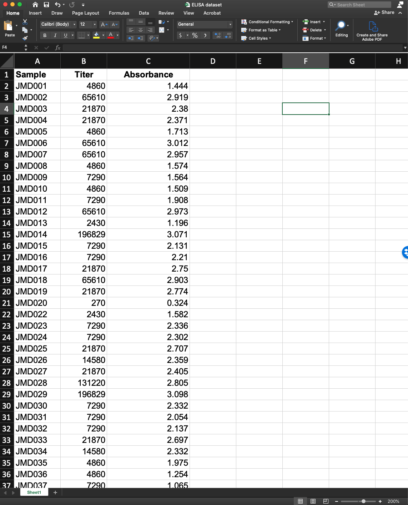

# IG titer quantification from fitted sigmoidal

## Table of contents
* [Overview](#Overview)
* [Input](#Input)
* [Output](#Output)

## Overview

## Input
dd
{:height="50px" width="50px"}

## Output
dd
